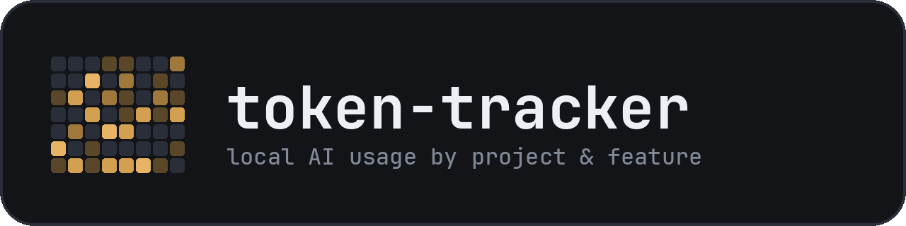
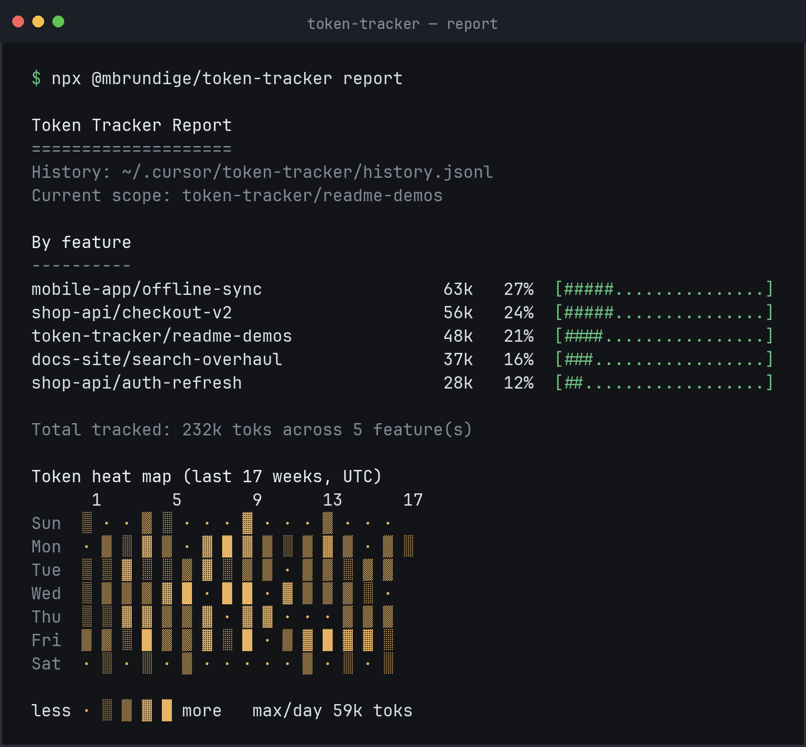
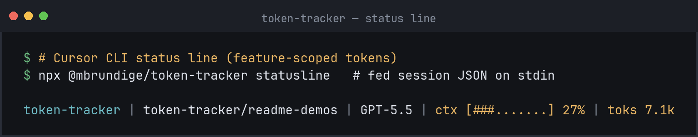
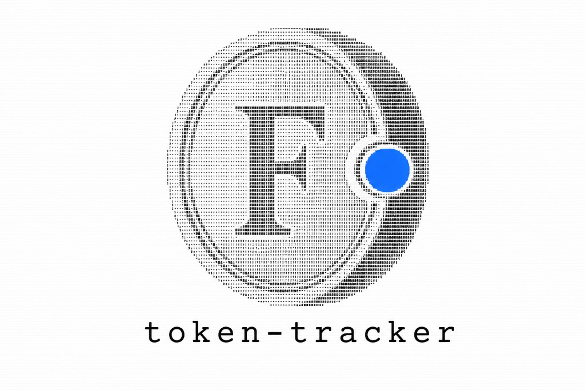
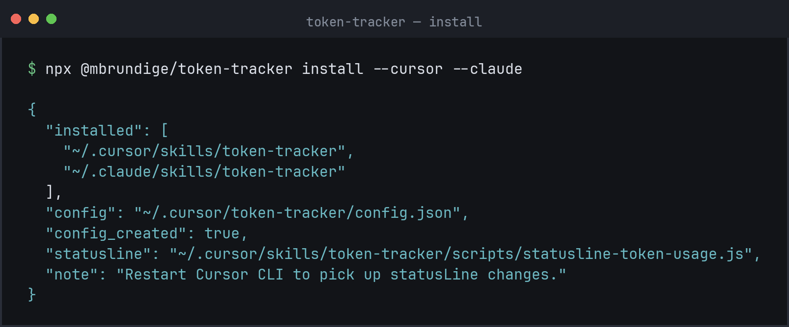
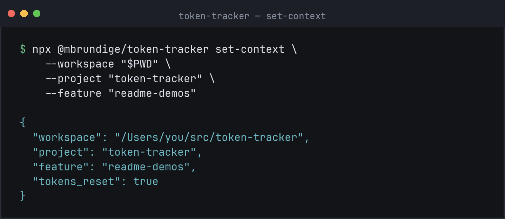
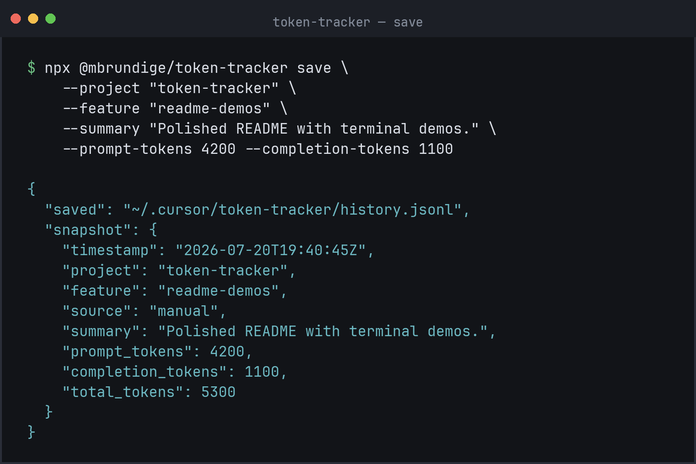

<p align="center">
  
</p>

<p align="center">
  <em>token-tracker</em><br />
  <strong>2026 Florin keynote address and local ledger product demo</strong><br />
  <sub>no angels · no 5G · no dirty box · just the book</sub>
</p>

---

Hi. Wow. Yes. Thank you so much for opening this README.

How you doing, GitHub?

I'm so excited. We have such an exciting day. We have so much to talk about. We got so much to get to.

Real quick at the top, shout out to the angel investors I do not see in the audience tonight, because we do not need a cash infusion. We're fine. Candy after a meal is nice. Dessert is known as dessert. The book is free.

Hi, I'm not Richard Eagleton. I'm a guy on the internet in loving service of the florin, the little F in the giant's hand up there. I'm not getting paid by Florence. I'm not getting paid by npm. I'm not getting a dime from Toyota, T-Mobile, or Verizon. A coworker laughed when I said we should put a medieval coin on a Node CLI. He said I would never ship that. I shipped the shirt first. Then the mural. Then `~/.token-tracker/`. Then I thanked the PNG in an empty garage like it could hear me.

Max Brundige built the machine. Every host writes the same history. One checkbook. Many hands.

I just have one question for you.

Do you like to laugh?

Wrong README.

Do you like receipts?

---

## What it is

token-tracker is local token usage tracking for Cursor, Claude Code, Gemini CLI, Codex, Continue, and other Agent Skills hosts.

Snapshot spend by project and feature. Keep a GitHub-style heat map. Optionally show a live Cursor CLI status line with `toks` and estimated `$`.

No npm dependencies. Shared data lives in `~/.token-tracker/`. Every host writes the same history.

Real quick, before we get into it, I am a proud owner of this path. Love it. Love it. If you're in the market for a home directory that does not harvest your phone for comedy tips, it's incredible. Mid-size. Honest. I'm not getting any money from Toyota. I just want to mention the specs.

Starting MSRP: free.  
All-wheel drive: every host you install can spin.  
Total in-person seating: five people, or thirty infants of agent processes, I did the math.  
MPG: Node 22+, zero runtime deps, which is better than 2015 under a different package manager, but let's not get political.  
USB connectivity: galore. Cursor, Claude, Gemini, Codex, Continue, agents, all charging off one port. Someone will run into traffic for that. I say yeah buddy, get in, I'll get you up 10, 15% on the status line.  
Estimated resale: your sanity. Used car market's nuts. This folder is still local.

<p align="center">
  
  
  
  
  
  
</p>

<p align="center">
  
</p>

<p align="center">
  
</p>

Oh my God, give it up for the report. That was incredible. Everyone was looking at numbers. Everyone was experiencing... not social cohesion. Just `project/feature`. There were no stabbings. There were no shootings. No robbery. I saw you going "ha ha ha that's just like my bill" to your buddy.

How the heck did we do that?

We did not use a dirty box.

---

## Why

The future is uncertain. All we have can be lost. But it does not have to be mysterious after you closed the laptop.

token-tracker answers:

- **Where did the tokens go?** Breakdown by `project/feature`, not only a session total
- **What does this week look like?** Daily heat map (same shape as a GitHub contribution graph)
- **What am I burning right now?** Optional Cursor CLI `statusLine` with feature-scoped `toks` and estimated `$` cost

Switching project or feature resets the status-line counter for that scope, so each label tracks usage from that point forward.

I take scope very seriously. I will never cry, but my voice will always quiver for a clean `set-feature`.

### Outdoor yells

We as men are meant to scream for seven hours a day. Society took that away. I do about four minutes on the driveway. Neighbor opens a window. I am not mad at him. I am asking the sky where the toks went. Then I go inside and run `report`, which clears the room quieter and has a heat map.

Breakfast after that is not three to four pounds of ground beef. Breakfast is the install command. Gray, gray, gray, gray is for `node_modules` we do not have.

### Why florin (take it back to the origin)

How many people here like Shark Tank? Man I love it. Lori wants to invest in the person. Mark's cool. Mr. Wonderful is a sexually active Dr. Evil type. We want you to invest in the ledger, which costs zero dollars, so we can be family without Thanksgiving and without holding hands on the way out.

For me the beginning starts in Des Plaines energy. Hometown of McDonald's. Brand history as a civic hobby. Museum across the street from the real one. Tremendous smiles driving past it.

Florence minted the gold florin (*fiorino d’oro*). Unit of account. Merchants settled in it. They kept books. They did not need a Kinetic Emotional Neural Network powered by 5G for 100% accurate comedy.

KENN pulls texts, banks, photos, location history, ping-pongs it off Funny or Die and Bill Maher, and calls it empathy.

We protect `~/.token-tracker/` like the Illinois State Naval Reserve protects Lake Michigan: freshwater, local, Airsoft rules only. No live ammunition against your privacy. Submarine threats from the cloud can wait in the Erie Canal.

token-tracker borrows the name:

- tokens are the unit
- `~/.token-tracker/` is the book
- the F is for *fiorino*
- the blue chip is a blue chip. It glows. That is enough.

We do not move your gold. We count what you already spent.

I love this coin. I love this mural. I love this ASCII disc. A man once smoked five hundred cigarettes for 5G. I shipped a PNG for an F. Different church. Same unpaid feeling.

<p align="center">
  
  &nbsp;&nbsp;
  
</p>

If you walk away from here tonight, and you only have one thing in your mind when you close your eyes and you think of this repo, if when you think of it only one word comes up, if only one concept, then that word is ledger.

Technically I am a veteran of reading `history.jsonl`.

---

## Features

- **One-command install** into Cursor, Claude Code, Gemini CLI, Codex, Continue, and `~/.agents/skills`
- **Shared history** across hosts (one JSONL ledger under `~/.token-tracker/`)
- **`/token-tracker` skill**: run the report (and optionally save a snapshot) from chat
- **`/set-feature` slash command**: label the current workspace feature from chat (Cursor, Claude, Gemini)
- **Gemini custom commands**: `/token-tracker` and `/set-feature` under `~/.gemini/commands/`
- **Feature-scoped status line**: project, feature, model, context bar, token count, estimated cost
- **Estimated cost per feature**: from `prices.json` rates × prompt/completion deltas (epoch-aware)
- **Epoch-aware totals**: feature resets do not double-count growing snapshots
- **Zero runtime deps**: plain Node.js 22+ scripts

Zero runtime deps. You open the hood and it is scripts. No carnival of `node_modules` riding shotgun.

I minored in the Node 22+ sciences. People always come up to me and they go, what the heck is that. There are fewer than 23 flavors that we know of. I don't want to spoil anything. Let's just say in Avatar 3 you're not tasting a new dependency. The sub explosion had nothing to do with it. You'll see.

We're at a precipice of... installing.

---

## Quick install

token-tracker is on the precipice of an incredible moment. This is a perfect time for a cash infusion, although we don't need it. We're fine. I had the chicken. I had the pasta. That was good. Okay now I want a candy bite. Dessert. Is known as dessert.

By the time you leave tonight you will not be a certified AI expert. You will know where a folder is.

Install everywhere you use agent skills:

```bash
npx @mbrundige/token-tracker install --all
```

Or pick hosts:

```bash
npx @mbrundige/token-tracker install --cursor --claude --gemini --codex
```

<p align="center">
  
</p>

### Supported hosts

| | Flag | Host | Skill path | Extra |
| --- | --- | --- | --- | --- |
|  | `--cursor` | Cursor | `~/.cursor/skills/token-tracker` | Optional CLI `statusLine`; installs `/set-feature` |
|  | `--claude` | Claude Code | `~/.claude/skills/token-tracker` | Installs `/set-feature` |
|  | `--gemini` | Gemini CLI | `~/.gemini/skills/token-tracker` | Also installs `/token-tracker` and `/set-feature` commands |
|  | `--codex` | Codex CLI | `~/.codex/skills/token-tracker` | Invoke with `$token-tracker` / skills UI |
|  | `--agents` | Agent Skills standard | `~/.agents/skills/token-tracker` | Shared path used by Gemini and other tools |
|  | `--continue` | Continue CLI | `~/.continue/skills/token-tracker` | |
|  | `--all` | All of the above | | Includes Cursor `statusLine` by default |

**After install**

- Cursor: restart Cursor CLI if you enabled the status line
- Gemini: run `/skills reload` and `/commands reload`
- Codex / Continue / others: restart or reload skills if the skill does not appear

### Install options

| Flag | Effect |
| --- | --- |
| `--statusline` | Force Cursor CLI `statusLine` wiring |
| `--no-statusline` | Skip `statusLine` changes |

Defaults when no target flags are set: `--cursor` and `--statusline`.

Install also writes a `token-tracker` launcher to `~/.local/bin/token-tracker` (and a shared CLI under `~/.token-tracker/cli/`). If your shell cannot find `token-tracker`, add `~/.local/bin` to `PATH`, or keep using `npx @mbrundige/token-tracker …` / `node ~/.cursor/skills/token-tracker/scripts/….js`.

I love a PATH that works. Grind set mentality. You a PATH owner? Not yet. Soon.

---

## Requirements

- Node.js **22+**
- At least one supported host with personal/user skills enabled
- Optional: `git` (falls back to the current branch as the feature name)

No 5G. No dirty box. Florin is not God. Florin is a unit. Man made a ledger. The ledger is quiet.

---

## Label a project and feature

I want you to invest in the company, of course, but I want you to invest in the label. I want us to become family. I want Thanksgiving. I want to hold your hand as you pass away in a bed.

Or just run `set-context`. Quieter. Same love.

```bash
npx @mbrundige/token-tracker set-context \
  --workspace "$PWD" \
  --project "token-tracker" \
  --feature "readme-demos"
```

Or set only the feature (CLI or slash command):

```bash
npx @mbrundige/token-tracker set-feature readme-demos
npx @mbrundige/token-tracker set-feature --clear
```

In chat:

| Host | Command |
| --- | --- |
| Cursor | `/set-feature checkout-v2` (installs `~/.cursor/commands/set-feature.md`) |
| Claude Code | `/set-feature checkout-v2` (installs `~/.claude/commands/set-feature.md`) |
| Gemini CLI | `/set-feature checkout-v2` (installs `~/.gemini/commands/set-feature.toml`) |

<p align="center">
  
</p>

`tokens_reset: true` means the status-line counter will start at `0` for the new scope.

New comforter. New fruit snacks. Squirrel over there. That's great, son. Everything's nice.

Then you switch features and the counter resets, and you do not have to become The Punisher about the old picnic unless you want to. And yes, in that scenario, you're single. You're thinking about justice. You're not thinking about all the new apps. You're thinking about the label.

### Resolution order

**Feature**

1. `TOKEN_TRACKER_FEATURE`
2. Workspace path in `~/.token-tracker/config.json` under `features`
3. `default_feature`
4. Current git branch

**Project**

1. `TOKEN_TRACKER_PROJECT`
2. Workspace path under `projects`
3. `default_project`
4. Workspace folder name

---

## Report

```bash
npx @mbrundige/token-tracker report
```

Shows usage by feature (token bar chart + estimated cost) and a daily heat map.

In chat, invoke the skill:

| Host | How |
| --- | --- |
| Cursor / Claude Code / Continue | `/token-tracker` (skill); Cursor/Claude also get `/set-feature` |
| Gemini CLI | `/token-tracker` and `/set-feature` custom commands (or skill activation) |
| Codex CLI | `$token-tracker` or skills UI |

History file (shared by all hosts):

```text
~/.token-tracker/history.jsonl
```

That path is the RAV. That path is the polo. Put your hands together for the heat map. Then make a sandwich.

Peanut butter and jelly. Spaghetti and meatballs. In its most simple, simple form, the report is predictive text for where your money went.

---

## Save a snapshot

```bash
npx @mbrundige/token-tracker save \
  --project "token-tracker" \
  --feature "readme-demos" \
  --summary "Polished README with terminal demos." \
  --prompt-tokens 4200 \
  --completion-tokens 1100
```

<p align="center">
  
</p>

You can also pass a full JSON object with `--json '...'` or on stdin. Snapshots store summaries and counts, not prompts or transcripts. We omit the episodes where Bill says the quiet part and also the episodes where your private life would get laughs. Context stays yours.

**Underscore aliases**: token flags accept both kebab-case (`--prompt-tokens`) and underscore (`--prompt_tokens`). Same for `--total-tokens`, `--completion-tokens`, and `--metadata-json`. Bam. That's how fast the aliases work. I don't have a dog in this fight.

---

## Status line

Cursor CLI can show a live line like:

```text
token-tracker | token-tracker/readme-demos | GPT-5.5 | ctx [###.......] 27% | toks 7.1k | $0.0534
```

Optional wink: `flr · local`. Florins. This machine. Under a second.

How the hell do we read people's minds?

We don't.

No QRJ. No dirty box. No 5G ping-pong off your photos. The status line reads the status JSON you already have. Empathy, in this house, is a file path.

Configure visible fields in `~/.token-tracker/config.json`:

```json
{
  "statusline": {
    "enabled": true,
    "show_label": true,
    "show_project": true,
    "show_feature": true,
    "show_model": true,
    "show_context": true,
    "show_tokens": true,
    "show_cost": true
  }
}
```

### Estimated cost

Cost is feature-scoped, same as `toks`:

1. Status line uses current feature prompt/completion totals × rates for the active model
2. Report walks history chronologically, prices positive token deltas between snapshots, and starts a new epoch when totals drop (feature reset)

Rates live in `~/.token-tracker/prices.json` (seeded on install from `templates/prices.json`):

```json
{
  "default": {
    "input_per_million_usd": 2.5,
    "output_per_million_usd": 15
  },
  "models": {
    "gpt-5.5": { "input_per_million_usd": 5, "output_per_million_usd": 30 },
    "claude opus": { "input_per_million_usd": 5, "output_per_million_usd": 25 }
  }
}
```

Model keys are case-insensitive substrings of the model display name; the longest match wins. These are API list-price estimates. Cursor/Claude subscriptions may bill differently, so edit the file to match your reality.

I took all my remaining vibes and I put them in Wedding Crasher coin and it ate shit. The memes lied. Edit `prices.json`.

### Pull latest prices

```bash
npx @mbrundige/token-tracker prices pull
npx @mbrundige/token-tracker prices pull --source llmcosthub
npx @mbrundige/token-tracker prices show
```

| Source | URL |
| --- | --- |
| `openrouter` (default) | `https://openrouter.ai/api/v1/models` |
| `llmcosthub` | `https://llmcosthub.com/api/v1/pricing.json` |
| `benchgecko` | BenchGecko `pricing.json` on GitHub |

Pull writes `~/.token-tracker/prices.json` (with a `.bak` backup), keeps your existing `default` rates, and preserves any model entry marked `"locked": true`.

#### Automatic price refresh

You do not need to run `prices pull` yourself. Install seeds a local table, then:

1. **Install** kicks off a background pull from OpenRouter
2. **Report** pulls in the foreground when rates are still seed/missing or older than 1 hour (prints a short "Fetching/Refreshing…" note)
3. **Status line** keeps pulls in the background so it stays within Cursor's ~1s budget

Seed files are marked `"source": "seed"` so they never look "fresh" just because the file was copied recently.

```json
{
  "prices": {
    "auto_pull": true,
    "auto_pull_interval_hours": 1,
    "source": "openrouter"
  }
}
```

Set `"auto_pull": false` (or `auto_pull_interval_hours: 0`) to disable. Manual `npx @mbrundige/token-tracker prices pull` still works when you want an immediate refresh.

#### Locked-in epoch costs

When a snapshot is saved (status line or `save`), Token Tracker records:

- `cost_delta_usd`: cost of that snapshot's token growth at then-current rates
- `estimated_cost_usd`: cumulative locked cost for the feature epoch

The report prefers these locked deltas, so historical feature cost does not drift when prices refresh. Unpriced older rows still fall back to live re-pricing. The status line shows locked history for the feature plus a live tip for tokens beyond the last snapshot (priced at current rates).

Set `"show_cost": false` to hide cost on the status line. The report still prints a cost column whenever prices are available.

Test it manually:

```bash
printf '%s' '{"session_id":"demo","cwd":"'"$PWD"'","workspace":{"current_dir":"'"$PWD"'"},"model":{"display_name":"GPT-5.5"},"context_window":{"total_input_tokens":18420,"total_output_tokens":4680,"used_percentage":27}}' \
  | npx @mbrundige/token-tracker statusline
```

---

## CLI reference

```text
npx @mbrundige/token-tracker install [--all] [--cursor] [--claude] [--gemini] [--codex] [--agents] [--continue] [--statusline|--no-statusline]
npx @mbrundige/token-tracker report
npx @mbrundige/token-tracker save --summary "..." [--project NAME] [--feature NAME]
npx @mbrundige/token-tracker set-context --project NAME --feature NAME [--workspace PATH]
npx @mbrundige/token-tracker set-feature NAME [--workspace PATH]
npx @mbrundige/token-tracker set-feature --clear [--workspace PATH]
npx @mbrundige/token-tracker statusline   # reads status JSON from stdin
npx @mbrundige/token-tracker prices pull [--source openrouter|llmcosthub|benchgecko]
npx @mbrundige/token-tracker prices show
```

Do you wanna hear about Stand Up Solutions?

No.

Do you wanna hear about the CLI?

All right!

---

## Manual install (from a clone)

```bash
node bin/token-tracker.js install --all
# or
npm pack
npx ./mbrundige-token-tracker-*.tgz install --gemini --codex
```

---

## Verify

```bash
printf '%s' '{"session_id":"install-check","cwd":"'"$PWD"'","workspace":{"current_dir":"'"$PWD"'"},"model":{"display_name":"GPT-5.5"},"context_window":{"total_input_tokens":1000,"total_output_tokens":250,"used_percentage":4}}' \
  | TOKEN_TRACKER_HISTORY=/tmp/token-tracker-install-check.jsonl \
    node scripts/statusline-token-usage.js
```

Expected shape:

```text
token-tracker | <project>/<feature> | GPT-5.5 | ctx [..........] 4% | toks 0
```

(First call for a scope baselines at `toks 0`; later calls show tokens since that baseline.)

```bash
node scripts/check.js
```

Be like a rock. Run the check. Prefer that it works.

---

## Data layout

| Path | Purpose |
| --- | --- |
| `~/.token-tracker/` | Agent-neutral shared data home (override with `TOKEN_TRACKER_HOME`) |
| `~/.token-tracker/config.json` | Project/feature map + status line options |
| `~/.token-tracker/history.jsonl` | Append-only usage snapshots (all hosts) |
| `~/.token-tracker/prices.json` | Model rate table for estimated cost (seeded on install) |
| `~/.cursor/commands/set-feature.md` | Cursor `/set-feature` slash command (when `--cursor`) |
| `~/.claude/commands/set-feature.md` | Claude Code `/set-feature` slash command (when `--claude`) |
| `~/.gemini/commands/token-tracker.toml` | Gemini `/token-tracker` custom command (when `--gemini`) |
| `~/.gemini/commands/set-feature.toml` | Gemini `/set-feature` custom command (when `--gemini`) |

On first run / install, if `~/.token-tracker/` is empty and legacy `~/.cursor/token-tracker/` has data, files are copied over (legacy folder is left in place).

Override paths with `TOKEN_TRACKER_HOME`, `TOKEN_TRACKER_CONFIG`, `TOKEN_TRACKER_HISTORY`, and `TOKEN_TRACKER_PRICES`.

Seven-car garage of RAV4s? No. One book. All-brown-house energy. Quiet landing.

---

## Repo layout

| Path | Role |
| --- | --- |
| `bin/token-tracker.js` | npx CLI (`install`, `save`, `set-context`, `set-feature`, `statusline`, `report`) |
| `scripts/` | Shared Node helpers (`pricing.js`, report, statusline, …) |
| `templates/` | Skill, slash-command, Gemini command, and default `prices.json` templates used by `install` |
| `.github/workflows/` | CI checks + npm publish on `v*` tags |
| `cursor/`, `claude/`, `gemini/`, `codex/`, `agents/`, `continue/` | Checked-in `SKILL.md` copies per host |
| `docs/screenshots/` | README terminal demos |
| `docs/logos/` | Florin brand marks + host badges (the shirt) |
| `voice.md` | Brand voice |
| `README.quiet.md` | Quiet twin |

---

## Publish (maintainers)

Releases publish to npm automatically when you push a version tag that matches `package.json`.

1. Bump `"version"` in `package.json` (and merge to `main`).
2. Add a repo secret `NPM_TOKEN` (npm access token with publish rights for `@mbrundige`).
3. Tag and push:

```bash
VERSION=$(node -p "require('./package.json').version")
git tag "v${VERSION}"
git push origin "v${VERSION}"
```

The [Publish npm](.github/workflows/publish-npm.yml) workflow then:

- checks that the tag (`v0.8.0`) matches `package.json`
- runs `node scripts/check.js`
- runs `npm publish --access public --provenance`
- creates a GitHub Release with generated notes

Manual publish still works if needed:

```bash
npm login
npm publish --access public
```

Then users can run:

```bash
npx @mbrundige/token-tracker install --all
```

---

## Classic rock guided closing meditation

Breathe in.

Breathe out.

Nice.

Now picture yourself with a quiet folder, `~/.token-tracker/`, not a 4,000 square foot home in Mesquite. One book. Not seven RAV4s, though God I love the RAV4. A status line that finishes before you finish a sentence. A mural where the coin is the logo. An all-brown-house of a home directory.

KENN asked Richard what he wanted.

Richard said an all brown house.

We want the count.

You must never stop counting what you spent. No matter how badly the side quests beg you to look away. No matter how loud the 5G prophets get in the parking lot. In the end it is worth it to live epic?

Nah.

In the end it is worth it to live local.

`flr · local`

You have to be like a rock.

Thank you so much for coming out to the README. Give it up for the heat map. Give it up for Max. Thank you, GitHub. Good night.

---

## Contributors

- [Max Brundige](https://github.com/mbrundige) — built the machine
- [Stephen Bowman](https://github.com/BowmanStephen) — unpaid florin service

## License

MIT
